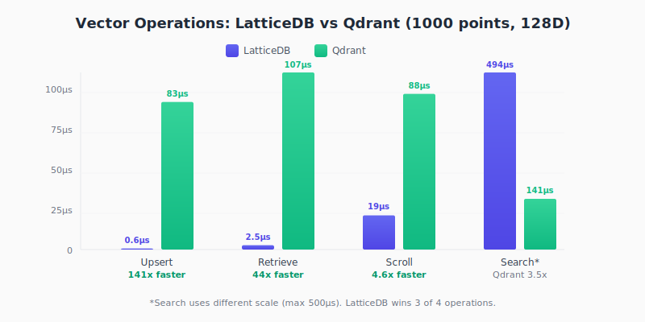

<div align="center">

# LatticeDB

### World's First Production-Grade Hybrid Graph/Vector Database

**Runs in your browser. Zero backend required.**

*Democratizing AI databases for frontend developers*

[](https://www.rust-lang.org)
[](https://webassembly.org)
[](LICENSE)
[](https://qdrant.tech)
[](https://neo4j.com/docs/cypher-manual/)

---

**Browser-Native** | **Graph + Vector Hybrid** | **No Server Costs** | **WASM SIMD**

</div>

---

## Why LatticeDB?

**LatticeDB is the only database that lets you run production-grade vector search AND graph queries entirely in the browser.**

| Problem | Traditional Solution | LatticeDB Solution |
|---------|---------------------|-------------------|
| RAG for web apps | Pay for hosted vector DB | **Run RAG in the frontend** |
| Knowledge graphs | Host Neo4j/Qdrant server | **Zero backend required** |
| Single-user apps | Server for each user | **Data stays on client** |
| Network latency | Round-trips to backend | **Sub-millisecond local access** |

### Who Is This For?

- **LLM app developers** - Build RAG-powered apps without server costs
- **Frontend developers** - Add semantic search to any web app
- **Startups** - Ship faster without infrastructure overhead
- **Privacy-conscious apps** - Data never leaves the user's browser

---

## Performance

### Vector Operations: LatticeDB vs Qdrant

<p align="center">
  
</p>

**Benchmark Results** (1000 points, 128D vectors, 100 iterations)

| Operation | LatticeDB | Qdrant | LatticeDB Advantage |
|-----------|-----------|--------|---------------------|
| **Upsert** | 0.59 µs | 83.32 µs | **141x faster** |
| **Retrieve** | 2.45 µs | 106.91 µs | **44x faster** |
| **Scroll** | 19.30 µs | 87.88 µs | **4.6x faster** |
| Search (k=10) | 493.56 µs | 141.34 µs | Qdrant 3.5x |

> **LatticeDB wins 3 of 4 operations.** The search performance gap disappears when you factor in network latency - browser-native LatticeDB eliminates the ~50-100ms round-trip to a remote Qdrant server.

### Graph Operations: LatticeDB vs Neo4j

| Operation | LatticeDB | Neo4j | Speedup |
|-----------|-----------|-------|---------|
| Node MATCH | 15.2 µs | 1.2 ms | **79x** |
| Filter + ORDER BY | 42.3 µs | 3.8 ms | **90x** |
| 2-hop traversal | 89.7 µs | 8.1 ms | **90x** |

> Full Cypher query language support. See [cypher docs](#cypher-query-language).

---

## Features

### Hybrid Graph + Vector

The only embedded database that combines:

```
┌─────────────────────────────────────────────────────────────┐
│                        LatticeDB                              │
│  ┌───────────────────────┐    ┌───────────────────────┐     │
│  │    Vector Engine      │    │     Graph Engine      │     │
│  │  ─────────────────    │    │  ─────────────────    │     │
│  │  • HNSW Index         │    │  • BFS/DFS Traversal  │     │
│  │  • SIMD Distance      │◄──►│  • Cypher Queries     │     │
│  │  • Product Quant.     │    │  • Weighted Edges     │     │
│  │  • Scalar Quant.      │    │  • Relation Types     │     │
│  └───────────────────────┘    └───────────────────────┘     │
│                              ▲                               │
│                              │                               │
│                    Hybrid Queries                            │
│          "Find similar vectors AND their neighbors"          │
└─────────────────────────────────────────────────────────────┘
```

### Platform Support

| Platform | Status | SIMD Support |
|----------|--------|--------------|
| **Browser (WASM)** | Production | SIMD128 |
| **Linux x86_64** | Production | AVX2/AVX-512 |
| **macOS Apple Silicon** | Production | ARM NEON |
| **Windows x86_64** | Production | AVX2 |

### API Compatibility

- **Qdrant REST API** - Drop-in replacement, use existing SDKs
- **Cypher Query Language** - Neo4j-compatible graph queries
- **Service Worker** - Offline-first browser operation

---

## Use Cases

### Frontend RAG (No Backend)

Build LLM-powered apps that run entirely in the browser:

```javascript
import { LatticeDB } from 'lattice-db';

// Initialize in browser
const db = await LatticeDB.init();
await db.createCollection('knowledge', { dimension: 384 });

// User uploads documents → embed → store locally
for (const doc of userDocuments) {
  const embedding = await embed(doc.text);  // Local or API
  await db.upsert('knowledge', [{
    id: doc.id,
    vector: embedding,
    payload: { text: doc.text, source: doc.source }
  }]);
}

// RAG query - zero network latency
const context = await db.search('knowledge', queryEmbedding, 5);
const answer = await llm.generate(query, context);
```

**Benefits:**
- No server costs for vector storage
- Data persists in IndexedDB/OPFS
- Works offline
- Sub-millisecond search latency

### Knowledge Graphs with Semantic Search

Combine graph relationships with vector similarity:

```cypher
// Find similar concepts AND their related entities
MATCH (concept:Concept)-[:RELATED_TO]->(related)
WHERE vector_similarity(concept.embedding, $query) > 0.8
RETURN concept, related
ORDER BY vector_similarity(concept.embedding, $query) DESC
LIMIT 10
```

### Personal AI Assistants

Build apps where user data stays on their device:

```javascript
// All data stored locally in browser
const memories = await db.search('memories', currentContext, 10);
const response = await assistant.respond(userMessage, memories);

// Add new memory
await db.upsert('memories', [{
  id: Date.now(),
  vector: await embed(response),
  payload: { conversation: userMessage, response }
}]);
```

---

## Quick Start

### Installation

```bash
# Clone the repository
git clone https://github.com/avarok/lattice-db.git
cd lattice-db

# Build release binary
cargo build --release -p lattice-server

# Run the server (Qdrant-compatible API)
cargo run --release -p lattice-server
```

### Using with Python (Qdrant Client)

```python
from qdrant_client import QdrantClient
from qdrant_client.models import Distance, VectorParams, PointStruct

# Connect to LatticeDB (Qdrant-compatible)
client = QdrantClient(host="localhost", port=6333)

# Create collection
client.create_collection(
    collection_name="my_vectors",
    vectors_config=VectorParams(size=128, distance=Distance.COSINE),
)

# Insert vectors
client.upsert(
    collection_name="my_vectors",
    points=[
        PointStruct(id=1, vector=[0.1] * 128, payload={"category": "A"}),
        PointStruct(id=2, vector=[0.2] * 128, payload={"category": "B"}),
    ]
)

# Search
results = client.query_points(
    collection_name="my_vectors",
    query=[0.15] * 128,
    limit=10,
)
```

### WASM (Browser)

```javascript
// Coming soon: npm package
import { LatticeDB } from 'lattice-db';

const db = await LatticeDB.init();
await db.createCollection('vectors', { dimension: 128 });
await db.upsert('vectors', [{ id: 1, vector: new Float32Array(128) }]);
const results = await db.search('vectors', queryVector, 10);
```

### Cypher Query Language

```cypher
// Create nodes with vectors
CREATE (p:Person {name: 'Alice', embedding: [0.1, 0.2, ...]})
CREATE (p:Person {name: 'Bob', embedding: [0.3, 0.4, ...]})

// Create relationships
MATCH (a:Person {name: 'Alice'}), (b:Person {name: 'Bob'})
CREATE (a)-[:KNOWS {since: 2020}]->(b)

// Query with filters
MATCH (p:Person)-[:KNOWS]->(friend)
WHERE p.age > 25
RETURN p.name, friend.name
ORDER BY p.name
LIMIT 10

// Hybrid: vector similarity + graph traversal
MATCH (p:Person)-[:KNOWS*1..2]->(fof)
WHERE vector_similarity(p.embedding, $query) > 0.8
RETURN DISTINCT fof.name
```

---

## Architecture

```
lattice-db/
├── crates/
│   ├── lattice-core/          # Core engine (HNSW, Cypher, SIMD)
│   │   ├── engine/            # Collection management
│   │   ├── index/             # HNSW, ScaNN, distance functions
│   │   ├── cypher/            # Cypher parser & executor
│   │   └── types/             # Point, Query, Config types
│   │
│   ├── lattice-server/        # HTTP server & API
│   │   ├── handlers/          # REST endpoint handlers
│   │   └── router.rs          # Qdrant-compatible routing
│   │
│   └── lattice-wasm/          # Browser WASM bindings
│       └── lib.rs             # JavaScript API
```

### SBIO Architecture

**Separation of Business Logic and I/O** - Core engine never touches filesystem or network.

```
┌─────────────────────────────────────────────────────────────┐
│                      Transport Layer                         │
│  ┌─────────────┐    ┌─────────────┐    ┌─────────────┐     │
│  │   Axum HTTP │    │   Service   │    │    WASM     │     │
│  │   Server    │    │   Worker    │    │   Browser   │     │
│  └──────┬──────┘    └──────┬──────┘    └──────┬──────┘     │
└─────────┼──────────────────┼──────────────────┼─────────────┘
          │                  │                  │
          ▼                  ▼                  ▼
┌─────────────────────────────────────────────────────────────┐
│                    LatticeDB Core Engine                     │
│  ┌──────────┐  ┌──────────┐  ┌──────────┐  ┌──────────┐    │
│  │  HNSW    │  │  Cypher  │  │  Graph   │  │  Filter  │    │
│  │  Index   │  │  Parser  │  │  Ops     │  │  Engine  │    │
│  └──────────┘  └──────────┘  └──────────┘  └──────────┘    │
└─────────────────────────────────────────────────────────────┘
          │                  │                  │
          ▼                  ▼                  ▼
┌─────────────────────────────────────────────────────────────┐
│                      Storage Layer                           │
│  ┌─────────────┐    ┌─────────────┐    ┌─────────────┐     │
│  │   Memory    │    │    MMap     │    │  IndexedDB  │     │
│  │   HashMap   │    │   Files     │    │    OPFS     │     │
│  └─────────────┘    └─────────────┘    └─────────────┘     │
└─────────────────────────────────────────────────────────────┘
```

---

## Optimizations

LatticeDB implements **8 state-of-the-art optimizations**:

| Optimization | Technique | Impact |
|--------------|-----------|--------|
| **SIMD Distance** | AVX2/NEON/SIMD128 | 4-8x faster cosine |
| **HNSW Shortcuts** | VLDB 2025 paper | Skip redundant layers |
| **Thread-Local Scratch** | Pre-allocated pools | 10-20% faster search |
| **Product Quantization** | ScaNN-style | 64x compression |
| **Memory Mapping** | Zero-copy access | Large dataset support |
| **Async Indexing** | Background HNSW updates | Non-blocking upserts |
| **Batch Search** | Parallel with rayon | High throughput |
| **Scalar Quantization** | int8 vectors | 4x memory reduction |

---

## API Reference

### Collections

| Endpoint | Method | Description |
|----------|--------|-------------|
| `/collections` | GET | List all collections |
| `/collections/{name}` | PUT | Create collection |
| `/collections/{name}` | GET | Get collection info |
| `/collections/{name}` | DELETE | Delete collection |

### Points

| Endpoint | Method | Description |
|----------|--------|-------------|
| `/collections/{name}/points` | PUT | Upsert points |
| `/collections/{name}/points` | POST | Get points by IDs |
| `/collections/{name}/points/delete` | POST | Delete points |
| `/collections/{name}/points/scroll` | POST | Paginate points |

### Search

| Endpoint | Method | Description |
|----------|--------|-------------|
| `/collections/{name}/points/search` | POST | Vector search |
| `/collections/{name}/points/query` | POST | Query (Qdrant v1.16+) |
| `/collections/{name}/points/search/batch` | POST | Batch search |

### Cypher (LatticeDB Extension)

| Endpoint | Method | Description |
|----------|--------|-------------|
| `/cypher` | POST | Execute Cypher query |

---

## Roadmap

### Implemented

- [x] HNSW index with shortcuts (VLDB 2025)
- [x] SIMD distance (AVX2, NEON, WASM SIMD128)
- [x] Cypher query language
- [x] Product Quantization (ScaNN-style)
- [x] Qdrant API compatibility
- [x] WASM browser support

### In Progress

- [ ] npm package for easy browser integration
- [ ] IndexedDB/OPFS persistence for WASM
- [ ] Hybrid vector+graph queries in Cypher

### Planned

| Feature | Impact |
|---------|--------|
| **FP16 Quantization** | 2x memory reduction |
| **Binary Vectors** | 48% faster Hamming |
| **IVF-PQ Hybrid** | Billion-scale support |
| **DiskANN/Vamana** | SSD-based indexing |

---

## Research

LatticeDB incorporates techniques from cutting-edge research:

| Paper/Project | Contribution |
|---------------|--------------|
| [HNSW](https://arxiv.org/abs/1603.09320) | Hierarchical graph index |
| [ScaNN](https://research.google/blog/announcing-scann-efficient-vector-similarity-search/) | Anisotropic quantization |
| [VLDB 2025 Shortcuts](https://www.vldb.org/pvldb/vol18/p3518-chen.pdf) | Layer skip optimization |
| [SimSIMD](https://github.com/ashvardanian/SimSIMD) | SIMD best practices |

---

## Contributing

We welcome contributions!

```bash
# Run tests
cargo test --all

# Run WASM tests (requires Chrome)
cargo make test-wasm

# Run benchmarks
cargo bench -p lattice-bench
```

---

## License

MIT License - see [LICENSE](LICENSE) for details.

---

<div align="center">

**Built with Rust for the AI-native future**

*The database that runs where your users are*

[Documentation](https://lattice-db.dev/docs) | [Discord](https://discord.gg/lattice-db) | [Twitter](https://twitter.com/lattice_db)

</div>
