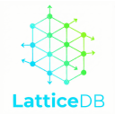
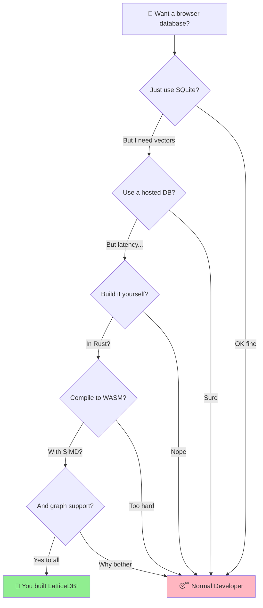

<div align="center">



# LatticeDB: World's First Hybrid Graph/Vector Database

### Built in pure Rust

**Runs in your browser. Zero backend required.**

*Democratizing AI databases for frontend developers*

[](https://avarok-cybersecurity.github.io/lattice-db/chat/)

[](https://github.com/Avarok-Cybersecurity/lattice-db/actions/workflows/ci.yml)
[](https://Avarok-Cybersecurity.github.io/lattice-db/)
[](https://www.rust-lang.org)
[](https://webassembly.org)
[](LICENSE-MIT)
[](https://qdrant.tech)
[](https://neo4j.com/docs/cypher-manual/)
[](#-ultra-low-footprint)
[](https://github.com/Avarok-Cybersecurity/lattice-db/actions/workflows/release.yml)

---

**Browser-Native** | **Graph + Vector Hybrid** | **No Server Costs** | **2.4 MB Memory**

</div>

---

## 📑 Table of Contents

| Section | Description |
|---------|-------------|
| [🎯 Why LatticeDB?](#-why-latticedb) | The problem we solve |
| [⚡ Performance](#-performance) | Benchmark results vs Qdrant & Neo4j |
| [🪶 Ultra-Low Footprint](#-ultra-low-footprint) | 2.4 MB memory, ~500 KB WASM |
| [🧬 What is a Hybrid Database?](#-what-is-a-hybrid-database) | Vector-attributed graph theory |
| &nbsp;&nbsp;&nbsp;↳ [Data Representation](#data-representation) | The Point struct |
| &nbsp;&nbsp;&nbsp;↳ [Mathematical Definition](#mathematical-definition) | Formal graph theory |
| [🔗 Why Hybrid?](#-why-hybrid) | Benefits of unified architecture |
| [✨ Features](#-features) | Hybrid graph/vector, platform support |
| [💡 Use Cases](#-use-cases) | RAG, knowledge graphs, AI assistants |
| [🚀 Quick Start](#-quick-start) | Installation & first steps |
| [🏗️ Architecture](#️-architecture) | SBIO pattern & crate structure |
| [🛡️ ACID Durability](#️-acid-durability) | WAL, crash recovery, storage modes |
| [⚙️ Optimizations](#️-optimizations) | 8 state-of-the-art techniques |
| [📚 API Reference](#-api-reference) | REST endpoints |
| [🗺️ Roadmap](#️-roadmap) | What's next |
| [🔬 Research](#-research) | Papers we build on |
| [❓ FAQ](#-faq) | Common questions answered |
| [🤝 Contributing](#-contributing) | How to help |
| [📄 License](#-license) | MIT License |

---

## 🎯 Why LatticeDB?

**LatticeDB is the only database that lets you run production-grade vector search AND graph queries entirely in the browser.**

| Problem | Traditional Solution | LatticeDB Solution |
|---------|---------------------|-------------------|
| RAG for web apps | Pay for hosted vector DB | **Run RAG in the frontend** |
| Knowledge graphs | Host Neo4j/Qdrant server | **Zero backend required** |
| Single-user apps | Server for each user | **Data stays on client** |
| Network latency | Round-trips to backend | **Sub-millisecond local access** |

### Who Is This For?

- 🤖 **LLM app developers** - Build RAG-powered apps without server costs
- 🌐 **Frontend developers** - Add semantic search to any web app
- 🚀 **Startups** - Ship faster without infrastructure overhead
- 🔒 **Privacy-conscious apps** - Data never leaves the user's browser

---

## ⚡ Performance

**Optimized for small to medium datasets** - the sweet spot for browser-based applications.

### Target Use Cases

LatticeDB shines for datasets typical in frontend applications:
- **Vectors**: 1K - 50K points (RAG contexts, document collections, user embeddings)
- **Graphs**: 1K - 10K nodes (knowledge graphs, relationship data, user networks)

At these scales, LatticeDB dramatically outperforms server-based solutions by eliminating network latency and running entirely in-process.

### Vector Operations: LatticeDB vs Qdrant

**Benchmark**: 1,000 vectors, 128 dimensions, cosine distance

| Operation | LatticeDB In-Memory¹ | LatticeDB HTTP² | Qdrant HTTP |
|-----------|---------------------|-----------------|-------------|
| **Search** | **84 µs** | **168 µs** | 330 µs |
| **Upsert** | **0.76 µs** | **115 µs** | 287 µs |
| **Retrieve** | **2.2 µs** | — | 306 µs |
| **Scroll** | **18 µs** | — | 398 µs |

¹ In-memory applies to browser/WASM deployments (no network overhead)
² HTTP server uses simd-json, Hyper with pipelining, TCP_NODELAY

> **LatticeDB wins in ALL deployment modes**: In-memory is **4-400x faster**. Even LatticeDB HTTP is **2-2.5x faster** than Qdrant HTTP.

### Graph Operations: LatticeDB vs Neo4j

**Benchmark**: 1,000 nodes with labels and properties, Cypher queries

| Operation | LatticeDB In-Memory¹ | LatticeDB HTTP² | Neo4j Bolt |
|-----------|---------------------|-----------------|------------|
| `MATCH (n) RETURN n LIMIT 100` | **74 µs** | **85 µs** | 1,147 µs |
| `MATCH (n:Person) RETURN n LIMIT 100` | **72 µs** | **110 µs** | 816 µs |
| `MATCH (n:Person) RETURN n LIMIT 10` | **12 µs** | **72 µs** | 596 µs |
| `ORDER BY n.name LIMIT 50` | **120 µs** | **173 µs** | 889 µs |
| `WHERE n.age > 30 RETURN n` | **619 µs** | **965 µs** | 3,136 µs |

¹ In-memory applies to browser/WASM deployments (no network overhead)
² HTTP server uses Hyper with pipelining, TCP_NODELAY

> **LatticeDB wins ALL graph operations**: In-memory is **5-78x faster**. Even LatticeDB HTTP is **3-13x faster** than Neo4j Bolt.

### Scaling Considerations

| Dataset Size | LatticeDB Advantage | Recommendation |
|--------------|---------------------|----------------|
| < 10K | **Excellent** (10-100x faster) | Ideal for browser/embedded use |
| 10K - 50K | **Good** (2-10x faster) | Still great for single-user apps |
| > 50K | **Diminishing** | Consider dedicated vector DB for large datasets |

For datasets exceeding 50K elements, server-based solutions like Qdrant or Neo4j may offer better performance due to their optimized indexing for large-scale workloads.

### Performance Roadmap

LatticeDB HTTP server optimization is ongoing:

- [x] SIMD-accelerated JSON parsing (simd-json)
- [x] Zero-copy request/response handling
- [x] Connection pipelining (HTTP/1.1)
- [ ] Response streaming for large results
- [ ] Binary protocol support (gRPC/protobuf)

Our primary focus remains **in-memory performance** for browser/WASM deployments where LatticeDB excels.

📖 [Full benchmark details](https://Avarok-Cybersecurity.github.io/lattice-db/book/performance/benchmarks.html)

---

## 🪶 Ultra-Low Footprint

LatticeDB is engineered for minimal resource consumption:

| Platform | Metric | Size |
|----------|--------|------|
| **Native** | Runtime Memory (RSS) | **2.4 MB** |
| **Browser (WASM)** | Bundle Size (gzip) | **~500 KB** |
| **Browser (WASM)** | Runtime Memory | **~2-3 MB** |

**Why this matters:**
- 💾 Runs on low-end devices and mobile browsers
- ⚡ Instant startup - no JVM warmup or heavy initialization
- 📱 Ideal for PWAs and offline-first applications
- 🌐 Fast download and parse time in browsers

Compare this to typical database footprints:
- PostgreSQL: ~20-50 MB baseline
- MongoDB: ~100-200 MB baseline
- Neo4j: ~500+ MB (JVM-based)
- Qdrant: ~50-100 MB baseline

LatticeDB delivers **full vector + graph database capabilities in under 3 MB**.

---

## 🧬 What is a Hybrid Database?

LatticeDB implements a **vector-attributed graph** — a data structure where each node combines the properties of both vector databases and graph databases:

| Component | Description | Use Case |
|-----------|-------------|----------|
| **Vector** | High-dimensional embedding ($\mathbb{R}^d$) | Semantic similarity search |
| **Payload** | Key-value metadata | Filtering and storage |
| **Edges** | Directed, weighted connections | Relationship traversal |

This unified model eliminates the need for separate databases while enabling powerful hybrid queries.

### Data Representation

Each point in LatticeDB is represented by the following structure:

```rust
pub struct Point {
    pub id: PointId,                           // u64 - unique identifier
    pub vector: Vector,                        // Vec<f32> - embedding
    pub payload: HashMap<String, Vec<u8>>,     // metadata
    pub outgoing_edges: Option<SmallVec<[Edge; 4]>>,  // graph links
    pub label_bitmap: u64,                     // O(1) label checks
}

pub struct Edge {
    pub target_id: PointId,   // destination node
    pub weight: f32,          // similarity/strength
    pub relation_id: u16,     // relationship type
}
```

### Mathematical Definition

Formally, LatticeDB implements a **Vector-Attributed Graph** defined as:

$$
G = (V, E, \phi, \psi, \omega)
$$

Where:

| Symbol | Definition |
|--------|------------|
| $V = \{v_1, \ldots, v_n\}$ | Set of vertices |
| $E \subseteq V \times V$ | Set of directed edges |
| $\phi: V \rightarrow \mathbb{R}^d$ | Vector embedding function |
| $\psi: V \rightarrow 2^{K \times \mathcal{V}}$ | Attribute function (key-value pairs) |
| $\omega: E \rightarrow \mathbb{R}$ | Edge weight function |

Each vertex $v_i$ is a tuple:

$$
v_i = \bigl(\, \text{id}_i,\; \phi(v_i),\; \psi(v_i),\; \{(v_j, \omega_{ij}) : (v_i, v_j) \in E\} \,\bigr)
$$

**Key operations** derive from this structure:

| Operation | Mathematical Form | Complexity |
|-----------|-------------------|------------|
| Vector Search | $\underset{v \in V}{\arg\min}\; d(\phi(v), \mathbf{q})$ | $O(\log n)$ via HNSW |
| Graph Traversal | $\{v_j : (v_i, v_j) \in E\}$ | $O(k)$ where $k$ = out-degree |
| Hybrid Query | Vector search $\cap$ subgraph filter | $O(\log n + k)$ |

> **This is what makes LatticeDB unique**: a single data structure that supports both $O(\log n)$ approximate nearest neighbor search *and* $O(k)$ graph traversal, unified in one ~500 KB WASM bundle.

---

## 🔗 Why Hybrid?

**One library for everything your frontend needs.**

Modern AI-powered applications require multiple database capabilities:

| Capability | Traditional Approach | LatticeDB Approach |
|------------|---------------------|-------------------|
| **Semantic Search** | Vector DB (Pinecone, Qdrant) | ✅ Built-in HNSW |
| **Knowledge Graphs** | Graph DB (Neo4j, Dgraph) | ✅ Built-in Cypher |
| **Document Storage** | Key-Value DB (Redis, DynamoDB) | ✅ Built-in Payload |
| **Relationship Queries** | SQL or Graph DB | ✅ Built-in Traversal |

### Why Not Separate Databases?

- 🔌 **Single Dependency** - One import, not three separate databases
- 🎯 **Unified Queries** - Vector similarity + graph traversal in one query
- 📦 **Smaller Bundle** - ~500 KB WASM vs multiple large dependencies
- 🧠 **Simpler Mental Model** - Points have vectors, payloads, AND relationships
- ⚡ **Zero Network Hops** - No coordination between services
- 💰 **No Server Costs** - Everything runs client-side

### The Hybrid Advantage

```javascript
// Find semantically similar documents AND their related concepts
const similar = await db.search({ vector: queryEmbedding, limit: 10 });
const related = await db.query(`
  MATCH (doc:Document)-[:REFERENCES]->(concept:Concept)
  WHERE doc.id IN $docIds
  RETURN DISTINCT concept.name
`, { docIds: similar.map(r => r.id) });
```

With separate databases, this requires:
1. Query vector DB for similar documents
2. Query graph DB for relationships
3. Coordinate results between two systems
4. Handle different data models and APIs

With LatticeDB, it's one library with unified data.

---

## ✨ Features

### Hybrid Graph + Vector

The only embedded database that combines:

```
┌─────────────────────────────────────────────────────────────┐
│                        LatticeDB                              │
│  ┌───────────────────────┐    ┌───────────────────────┐     │
│  │    Vector Engine      │    │     Graph Engine      │     │
│  │  ─────────────────    │    │  ─────────────────    │     │
│  │  • HNSW Index         │    │  • BFS/DFS Traversal  │     │
│  │  • SIMD Distance      │◄──►│  • Cypher Queries     │     │
│  │  • Product Quant.     │    │  • Weighted Edges     │     │
│  │  • Scalar Quant.      │    │  • Relation Types     │     │
│  └───────────────────────┘    └───────────────────────┘     │
│                              ▲                               │
│                              │                               │
│                    Hybrid Queries                            │
│          "Find similar vectors AND their neighbors"          │
└─────────────────────────────────────────────────────────────┘
```

### Platform Support

| Platform | Status | SIMD Support |
|----------|--------|--------------|
| 🌐 **Browser (WASM)** | Production | SIMD128 |
| 🐧 **Linux x86_64** | Production | AVX2/AVX-512 |
| 🍎 **macOS Apple Silicon** | Production | ARM NEON |
| 🪟 **Windows x86_64** | Production | AVX2 |

### API Compatibility

- 🔌 **Qdrant REST API** - Drop-in replacement, use existing SDKs
- 📊 **Cypher Query Language** - Neo4j-compatible graph queries
- 📴 **Service Worker** - Offline-first browser operation *(coming soon)*

---

## 💡 Use Cases

### Frontend RAG (No Backend)

Build LLM-powered apps that run entirely in the browser:

```javascript
import { LatticeDB } from 'lattice-db';

// Initialize in browser
const db = await LatticeDB.init();
await db.createCollection('knowledge', { dimension: 384 });

// User uploads documents → embed → store locally
for (const doc of userDocuments) {
  const embedding = await embed(doc.text);  // Local or API
  await db.upsert('knowledge', [{
    id: doc.id,
    vector: embedding,
    payload: { text: doc.text, source: doc.source }
  }]);
}

// RAG query - zero network latency
const context = await db.search('knowledge', queryEmbedding, 5);
const answer = await llm.generate(query, context);
```

**Benefits:**
- 💰 No server costs for vector storage
- 💾 Data persists in IndexedDB/OPFS
- 📴 Works offline
- ⚡ Sub-millisecond search latency

### Knowledge Graphs with Semantic Search

Combine graph relationships with vector similarity:

```cypher
// Find similar concepts AND their related entities
MATCH (concept:Concept)-[:RELATED_TO]->(related)
WHERE vector_similarity(concept.embedding, $query) > 0.8
RETURN concept, related
ORDER BY vector_similarity(concept.embedding, $query) DESC
LIMIT 10
```

### Personal AI Assistants

Build apps where user data stays on their device:

```javascript
// All data stored locally in browser
const memories = await db.search('memories', currentContext, 10);
const response = await assistant.respond(userMessage, memories);

// Add new memory
await db.upsert('memories', [{
  id: Date.now(),
  vector: await embed(response),
  payload: { conversation: userMessage, response }
}]);
```

---

## 🚀 Quick Start

### Installation

```bash
# Clone the repository
git clone https://github.com/Avarok-Cybersecurity/lattice-db.git
cd lattice-db

# Build release binary
cargo build --release -p lattice-server

# Run the server (Qdrant-compatible API)
cargo run --release -p lattice-server
```

### Using with Python (Qdrant Client)

```python
from qdrant_client import QdrantClient
from qdrant_client.models import Distance, VectorParams, PointStruct

# Connect to LatticeDB (Qdrant-compatible)
client = QdrantClient(host="localhost", port=6333)

# Create collection
client.create_collection(
    collection_name="my_vectors",
    vectors_config=VectorParams(size=128, distance=Distance.COSINE),
)

# Insert vectors
client.upsert(
    collection_name="my_vectors",
    points=[
        PointStruct(id=1, vector=[0.1] * 128, payload={"category": "A"}),
        PointStruct(id=2, vector=[0.2] * 128, payload={"category": "B"}),
    ]
)

# Search
results = client.query_points(
    collection_name="my_vectors",
    query=[0.15] * 128,
    limit=10,
)
```

### WASM (Browser)

```javascript
import { LatticeDB } from 'lattice-db';

const db = await LatticeDB.init();
await db.createCollection('vectors', { dimension: 128 });
await db.upsert('vectors', [{ id: 1, vector: new Float32Array(128) }]);
const results = await db.search('vectors', queryVector, 10);
```

### Cypher Query Language

```cypher
// Create nodes with vectors
CREATE (p:Person {name: 'Alice', embedding: [0.1, 0.2, ...]})
CREATE (p:Person {name: 'Bob', embedding: [0.3, 0.4, ...]})

// Create relationships
MATCH (a:Person {name: 'Alice'}), (b:Person {name: 'Bob'})
CREATE (a)-[:KNOWS {since: 2020}]->(b)

// Query with filters
MATCH (p:Person)-[:KNOWS]->(friend)
WHERE p.age > 25
RETURN p.name, friend.name
ORDER BY p.name
LIMIT 10

// Hybrid: vector similarity + graph traversal
MATCH (p:Person)-[:KNOWS*1..2]->(fof)
WHERE vector_similarity(p.embedding, $query) > 0.8
RETURN DISTINCT fof.name
```

---

## 🏗️ Architecture

```
lattice-db/
├── crates/
│   ├── lattice-core/          # Core engine (HNSW, Cypher, SIMD)
│   │   ├── engine/            # Collection management
│   │   ├── index/             # HNSW, ScaNN, distance functions
│   │   ├── cypher/            # Cypher parser & executor
│   │   └── types/             # Point, Query, Config types
│   │
│   ├── lattice-server/        # HTTP server & API
│   │   ├── handlers/          # REST endpoint handlers
│   │   └── router.rs          # Qdrant-compatible routing
│   │
│   └── lattice-wasm/          # Browser WASM bindings
│       └── lib.rs             # JavaScript API
```

### SBIO Architecture

**Separation of Business Logic and I/O** - Core engine never touches filesystem or network.

```
┌─────────────────────────────────────────────────────────────┐
│                      Transport Layer                         │
│  ┌─────────────┐    ┌─────────────┐    ┌─────────────┐     │
│  │   Axum HTTP │    │   Service   │    │    WASM     │     │
│  │   Server    │    │   Worker    │    │   Browser   │     │
│  └──────┬──────┘    └──────┬──────┘    └──────┬──────┘     │
└─────────┼──────────────────┼──────────────────┼─────────────┘
          │                  │                  │
          ▼                  ▼                  ▼
┌─────────────────────────────────────────────────────────────┐
│                    LatticeDB Core Engine                     │
│  ┌──────────┐  ┌──────────┐  ┌──────────┐  ┌──────────┐    │
│  │  HNSW    │  │  Cypher  │  │  Graph   │  │  Filter  │    │
│  │  Index   │  │  Parser  │  │  Ops     │  │  Engine  │    │
│  └──────────┘  └──────────┘  └──────────┘  └──────────┘    │
└─────────────────────────────────────────────────────────────┘
          │                  │                  │
          ▼                  ▼                  ▼
┌─────────────────────────────────────────────────────────────┐
│                      Storage Layer                           │
│  ┌─────────────┐    ┌─────────────┐    ┌─────────────┐     │
│  │   Memory    │    │    MMap     │    │  IndexedDB  │     │
│  │   HashMap   │    │   Files     │    │    OPFS     │     │
│  └─────────────┘    └─────────────┘    └─────────────┘     │
└─────────────────────────────────────────────────────────────┘
```

---

## 🛡️ ACID Durability

LatticeDB supports **durable, crash-safe storage** via a Write-Ahead Log (WAL) and pluggable storage backends. Data integrity is not optional — it is built into the engine.

### Storage Modes

| Mode | Backend | Durability | Use Case |
|------|---------|------------|----------|
| **Ephemeral** | In-memory only | None (process lifetime) | Browser/WASM, testing, caches |
| **Durable** | `DiskStorage` + WAL | Full ACID | Server deployments, persistent data |

### Write-Ahead Log (WAL)

Every mutation is written to the WAL **before** it is applied to the main store. On crash or restart, the WAL replays uncommitted entries to restore consistent state.

```
 Client Write
      │
      ▼
┌─────────────┐     ┌─────────────┐     ┌─────────────┐
│  Append to  │────►│  Apply to   │────►│   fsync()   │
│  WAL page   │     │  in-memory  │     │   storage   │
└─────────────┘     └─────────────┘     └─────────────┘
      │
      ▼ (on restart)
┌─────────────┐
│  Replay WAL │
│  entries    │
└─────────────┘
```

**Crash safety guarantee:** if a write is acknowledged, it survives process crashes. If a crash occurs mid-write, recovery replays from the last known-good WAL state — orphaned page data is unreachable and overwritten on next rotation.

### What We Test

LatticeDB includes a dedicated ACID test suite (`lattice-test-harness` + integration tests) covering:

| Test Category | What It Verifies |
|---------------|------------------|
| **Crash recovery** | Data survives simulated process crashes at every WAL phase |
| **Page rotation** | WAL rotates pages without data loss under concurrent writes |
| **I/O failures** | Storage errors propagate correctly, never corrupt state |
| **Engine lifecycle** | Open → write → close → reopen → read back intact |
| **Stress ordering** | Concurrent upserts maintain consistency under contention |

```bash
# Run the full ACID test suite
cargo test --workspace -- acid
```

### Enabling Durable Mode

```rust
use lattice_storage::DiskStorage;

let storage = DiskStorage::with_defaults("/var/lib/lattice/my_collection".into());
storage.init().await?;

// Pass storage to the engine — WAL is enabled automatically
```

For browser deployments, LatticeDB runs in ephemeral mode (IndexedDB/OPFS persistence is handled separately by the WASM layer).

---

## ⚙️ Optimizations

LatticeDB implements **8 state-of-the-art optimizations**:

| Optimization | Technique | Impact |
|--------------|-----------|--------|
| ⚡ **SIMD Distance** | AVX2/NEON/SIMD128 | 4-8x faster cosine |
| 🔗 **HNSW Shortcuts** | VLDB 2025 paper | Skip redundant layers |
| 🧵 **Thread-Local Scratch** | Pre-allocated pools | 10-20% faster search |
| 📦 **Product Quantization** | ScaNN-style | 64x compression |
| 💾 **Memory Mapping** | Zero-copy access | Large dataset support |
| 🔄 **Async Indexing** | Background HNSW updates | Non-blocking upserts |
| 📊 **Batch Search** | Parallel with rayon | High throughput |
| 🗜️ **Scalar Quantization** | int8 vectors | 4x memory reduction |

---

## 📚 API Reference

### Collections

| Endpoint | Method | Description |
|----------|--------|-------------|
| `/collections` | GET | List all collections |
| `/collections/{name}` | PUT | Create collection |
| `/collections/{name}` | GET | Get collection info |
| `/collections/{name}` | DELETE | Delete collection |

### Points

| Endpoint | Method | Description |
|----------|--------|-------------|
| `/collections/{name}/points` | PUT | Upsert points |
| `/collections/{name}/points` | POST | Get points by IDs |
| `/collections/{name}/points/delete` | POST | Delete points |
| `/collections/{name}/points/scroll` | POST | Paginate points |

### Search

| Endpoint | Method | Description |
|----------|--------|-------------|
| `/collections/{name}/points/search` | POST | Vector search |
| `/collections/{name}/points/query` | POST | Query (Qdrant v1.16+) |
| `/collections/{name}/points/search/batch` | POST | Batch search |

### Import/Export (LatticeDB Extension)

| Endpoint | Method | Description |
|----------|--------|-------------|
| `/collections/{name}/export` | GET | Export collection as binary |
| `/collections/{name}/import?mode={mode}` | POST | Import collection (`create`/`replace`/`merge`) |

### Graph Extensions (LatticeDB)

| Endpoint | Method | Description |
|----------|--------|-------------|
| `/collections/{name}/graph/edges` | POST | Add edge between points |
| `/collections/{name}/graph/traverse` | POST | Traverse graph from point |
| `/collections/{name}/graph/query` | POST | Execute Cypher query |

📖 [Full API documentation](https://Avarok-Cybersecurity.github.io/lattice-db/book/api/rest.html)

---

## 🗺️ Roadmap

### ✅ Implemented

- [x] HNSW index with shortcuts (VLDB 2025)
- [x] SIMD distance (AVX2, NEON, WASM SIMD128)
- [x] Cypher query language
- [x] Product Quantization (ScaNN-style)
- [x] Qdrant API compatibility
- [x] WASM browser support
- [x] npm package (`lattice-db`)
- [x] IndexedDB/OPFS persistence
- [x] Hybrid vector+graph queries

### 🔨 In Progress

- [ ] Data migrator tool (import from Qdrant/Neo4j)
- [ ] Payload & metadata encryption (AES-256)
- [ ] npm package improvements & documentation

### 📋 Planned

| Feature | Impact |
|---------|--------|
| **FP16 Quantization** | 2x memory reduction |
| **Binary Vectors** | 48% faster Hamming |
| **IVF-PQ Hybrid** | Billion-scale support |
| **DiskANN/Vamana** | SSD-based indexing |

---

## 🔬 Research

LatticeDB incorporates techniques from cutting-edge research:

| Paper/Project | Contribution |
|---------------|--------------|
| [HNSW](https://arxiv.org/abs/1603.09320) | Hierarchical graph index |
| [ScaNN](https://research.google/blog/announcing-scann-efficient-vector-similarity-search/) | Anisotropic quantization |
| [VLDB 2025 Shortcuts](https://www.vldb.org/pvldb/vol18/p3518-chen.pdf) | Layer skip optimization |
| [SimSIMD](https://github.com/ashvardanian/SimSIMD) | SIMD best practices |

---

## ❓ FAQ

<details>
<summary><b>🔷 I just want a graph database. Does LatticeDB support that?</b></summary>

**Yes!** LatticeDB is a fully-featured graph database with Cypher query support. You can use it purely as a graph DB without touching vectors:

```cypher
// Create nodes
CREATE (alice:Person {name: 'Alice', age: 30})
CREATE (bob:Person {name: 'Bob', age: 25})

// Create relationships
MATCH (a:Person {name: 'Alice'}), (b:Person {name: 'Bob'})
CREATE (a)-[:FRIENDS_WITH {since: 2020}]->(b)

// Query relationships
MATCH (p:Person)-[:FRIENDS_WITH]->(friend)
RETURN p.name, friend.name
```

The vector field is optional - just don't include it and you have a lightweight graph database.

</details>

<details>
<summary><b>🔶 I just want a vector database. Can I use LatticeDB for that?</b></summary>

**Also yes!** LatticeDB implements the Qdrant REST API, so you can use it as a pure vector database:

```python
from qdrant_client import QdrantClient

client = QdrantClient(host="localhost", port=6333)
client.create_collection("my_vectors", vectors_config={"size": 128, "distance": "Cosine"})
client.upsert("my_vectors", points=[...])
results = client.search("my_vectors", query_vector=[...], limit=10)
```

The graph features (edges, Cypher) are optional - simply don't use them and you have a fast vector database.

</details>

<details>
<summary><b>🔌 Can I use an existing Qdrant client to connect to LatticeDB?</b></summary>

**Yes!** LatticeDB implements the Qdrant REST API, so any Qdrant client works out of the box:

- ✅ Python: `qdrant-client`
- ✅ JavaScript/TypeScript: `@qdrant/js-client-rest`
- ✅ Go: `qdrant-go`
- ✅ Rust: `qdrant-client`

Just point your client to LatticeDB instead of Qdrant:

```python
# Instead of: QdrantClient(host="your-qdrant-server")
client = QdrantClient(host="localhost", port=6333)  # LatticeDB
```

See the [Quick Start](#-quick-start) section for a complete example.

</details>

<details>
<summary><b>📊 Do Cypher commands from Neo4j work with LatticeDB?</b></summary>

**Yes!** LatticeDB supports standard Cypher query language:

```cypher
// All these work in LatticeDB
MATCH (n:Label) RETURN n
MATCH (a)-[r:RELATION]->(b) WHERE a.prop = 'value' RETURN a, b
CREATE (n:Person {name: 'Alice'})
MATCH (a), (b) WHERE a.id = 1 AND b.id = 2 CREATE (a)-[:KNOWS]->(b)
MATCH (n) WHERE n.age > 25 RETURN n ORDER BY n.name LIMIT 10
```

LatticeDB's Cypher parser handles `MATCH`, `WHERE`, `RETURN`, `CREATE`, `ORDER BY`, `LIMIT`, and relationship traversals.

</details>

<details>
<summary><b>⚡ Why is LatticeDB faster than both Qdrant and Neo4j?</b></summary>

Several architectural advantages combine to make LatticeDB faster:

| Factor | Impact |
|--------|--------|
| **No network overhead** | In-browser/embedded = zero RTT latency |
| **No JVM** | Native Rust vs Neo4j's Java runtime |
| **SIMD acceleration** | AVX2/NEON/WASM SIMD128 for distance calculations |
| **In-process execution** | No serialization/deserialization between client and server |
| **Optimized for small-medium data** | Algorithms tuned for 1K-50K points |
| **Zero-copy operations** | Memory-mapped files, direct data access |

For browser deployments, eliminating the network round-trip alone provides **100x+ speedup** compared to hosted databases.

</details>

<details>
<summary><b>🌐 How can you possibly run a database in a browser?</b></summary>

**100% Rust compiled to WebAssembly (WASM).**

```
Rust Source Code
      ↓
  wasm-pack
      ↓
WebAssembly Module (~500 KB gzipped)
      ↓
Runs in Browser with near-native speed
```

Key technologies that make this possible:

- **Rust → WASM**: The entire codebase compiles to WASM with zero JavaScript
- **WASM SIMD128**: Browser-native SIMD for fast vector operations
- **IndexedDB/OPFS**: Persistent storage APIs for durability
- **Web Workers**: Background indexing without blocking the UI

The same code runs natively (Linux/macOS/Windows) and in browsers - true write-once, run-anywhere.

</details>

<details>
<summary><b>🔄 How do I migrate from Neo4j or Qdrant to LatticeDB?</b></summary>

**We're working on a data migration tool!** 🚧

The planned migrator will support:

- **Qdrant → LatticeDB**: Export collections and import via the compatible API
- **Neo4j → LatticeDB**: Export Cypher dumps and replay CREATE statements

For now, you can manually migrate by:

1. Exporting data from your source database
2. Using LatticeDB's API to import (Qdrant client for vectors, Cypher for graphs)

**Stay tuned!** Follow the [GitHub repo](https://github.com/Avarok-Cybersecurity/lattice-db) for migration tool updates.

</details>

<details>
<summary><b>💾 Where is data stored when running in the browser?</b></summary>

LatticeDB uses browser-native storage APIs:

| Storage | Use Case | Capacity |
|---------|----------|----------|
| **IndexedDB** | Persistent key-value storage | ~50% of free disk |
| **OPFS** | File system API (faster) | ~50% of free disk |
| **Memory** | Temporary/ephemeral mode | Limited by browser |

Data persists across browser sessions and survives page refreshes. For OPFS, data is sandboxed per-origin (your domain only).

</details>

<details>
<summary><b>📴 Does LatticeDB work offline?</b></summary>

**Yes!** LatticeDB is designed for offline-first applications:

- ✅ All operations run locally - no server required
- ✅ Data persists in IndexedDB/OPFS
- ✅ Perfect for PWAs (Progressive Web Apps)
- ✅ Works on airplane mode, spotty connections, etc.

Once the WASM module and your data are loaded, LatticeDB requires zero network connectivity.

</details>

<details>
<summary><b>🖥️ Can I host LatticeDB on a centralized server?</b></summary>

**Absolutely!** LatticeDB has blazing-fast native support for server deployments:

```bash
# Run as a server (Qdrant-compatible API)
cargo run --release -p lattice-server
# Listening on http://localhost:6333
```

This is perfect for:

- 🔄 **Multi-user real-time sync** - All clients connect to the same server
- 🏢 **Enterprise deployments** - Central data management and access control
- 📊 **Larger datasets** - Server has more memory than browser tabs
- 🔐 **Sensitive data** - Keep vectors and payloads on infrastructure you control

You get the same API whether running in-browser (WASM) or on a server (native) - same code, same queries, flexible deployment.

</details>

<details>
<summary><b>⚠️ When should I NOT use LatticeDB?</b></summary>

Consider alternatives when:

| Scenario | Why | Alternative |
|----------|-----|-------------|
| **Massive datasets (>100K vectors)** | Browser memory limits, indexing time | Hosted Qdrant, Pinecone |
| **Strict data centralization** | LatticeDB runs on client devices | Traditional server DB |
| **Sensitive IP in vectors** | Data lives on user's device | Server-side vector DB |

**However**, many "centralized" use cases still work great:

```javascript
// App downloads latest embeddings from your server on startup
const latestData = await fetch('/api/knowledge-base');
await db.import('knowledge', latestData);
// Now queries run locally - fast & free!
```

This pattern gives you **centralized data synchronicity** without paying for compute - clients do all the heavy lifting. Great for knowledge bases, documentation, product catalogs, etc.

</details>

<details>
<summary><b>🔐 Does LatticeDB have at-rest encryption?</b></summary>

**Not yet, but it's coming soon!**

We're working on encryption support for:

- 🔒 **Payload encryption** - Encrypt the metadata stored with each point
- 🔒 **Metadata encryption** - Encrypt collection and point metadata

> **Note:** Vector encryption is not planned - vectors must remain unencrypted for similarity search to work. If your embeddings contain sensitive information, consider using privacy-preserving embedding techniques.

For now, if you need encryption, consider:
- Encrypting sensitive payload fields before inserting
- Using the browser's Web Crypto API for client-side encryption
- Running in a secure context (HTTPS only)

**Stay tuned!** Payload encryption is on the roadmap.

</details>

<details>
<summary><b>🤔 Why hasn't anyone built this before?</b></summary>

Great question! Here's our totally scientific analysis:



Real talk: it required several technologies to mature simultaneously:

1. **WASM SIMD** - Only standardized in 2021
2. **OPFS** - File system API for browsers, relatively new
3. **Rust ecosystem** - `wasm-pack`, `wasm-bindgen` needed to mature
4. **Someone crazy enough** - To think "what if Neo4j but in a browser?" 🤪

We're just built different. (And by "different" we mean "slightly unhinged Rust developers who think everything should compile to WASM.")

</details>

---

## 🤝 Contributing

We welcome contributions!

```bash
# Run tests
cargo test --all

# Run WASM tests (requires Chrome)
wasm-pack test --headless --chrome crates/lattice-core

# Run benchmarks
cargo bench -p lattice-bench
```

📖 [Contributing guide](https://Avarok-Cybersecurity.github.io/lattice-db/book/contributing/setup.html)

---

## 📄 License

Licensed under either of:

- Apache License, Version 2.0 ([LICENSE-APACHE](LICENSE-APACHE) or http://www.apache.org/licenses/LICENSE-2.0)
- MIT license ([LICENSE-MIT](LICENSE-MIT) or http://opensource.org/licenses/MIT)

at your option.

---

<div align="center">

**Built with 🦀 Rust for the AI-native future**

*The database that runs where your users are*

[📖 Documentation](https://Avarok-Cybersecurity.github.io/lattice-db/) | [📚 API Reference](https://Avarok-Cybersecurity.github.io/lattice-db/api/) | [💬 Discord](https://discord.gg/lattice-db)

</div>
